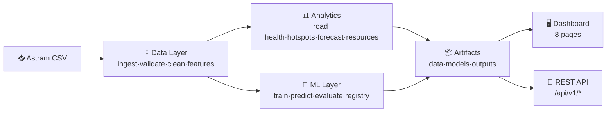
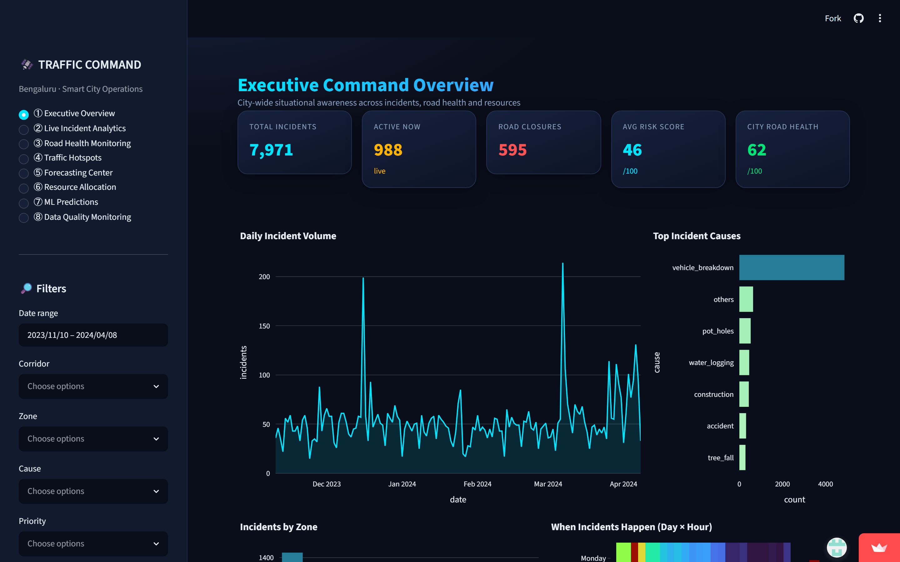
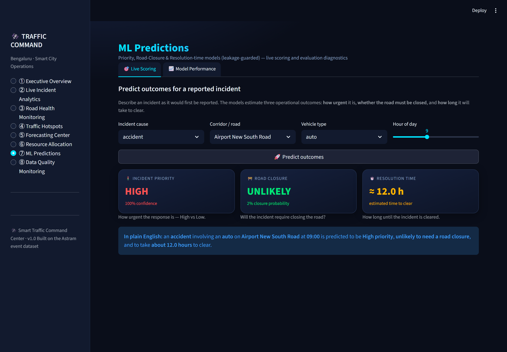
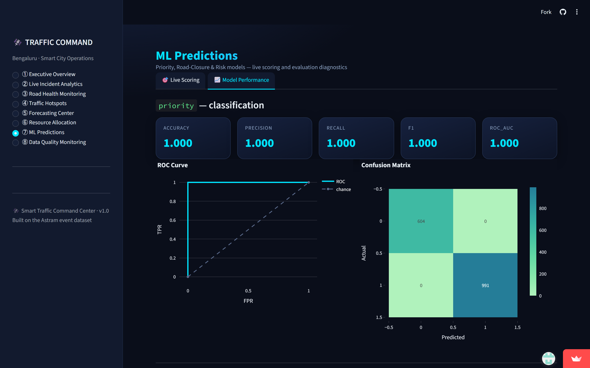
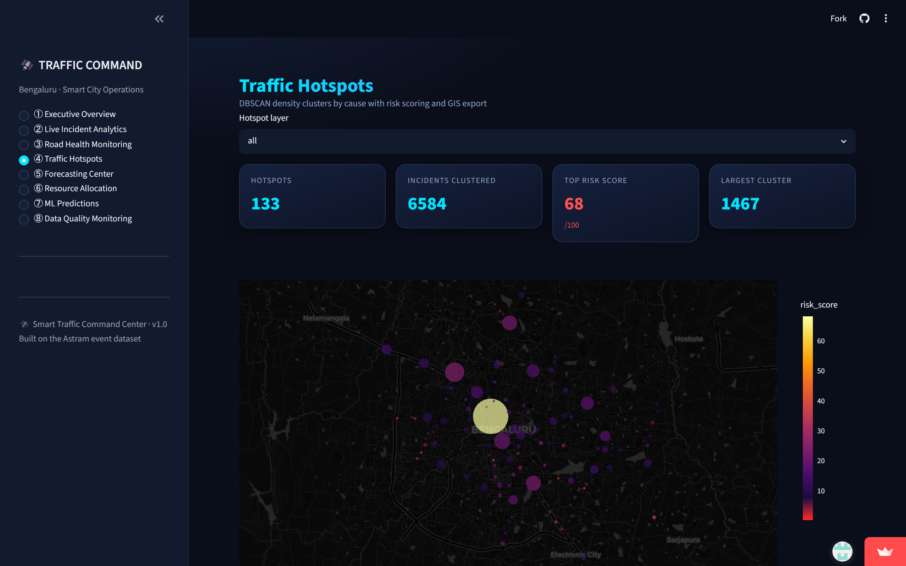
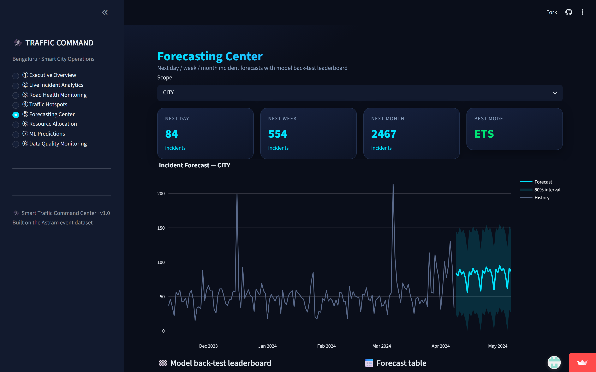
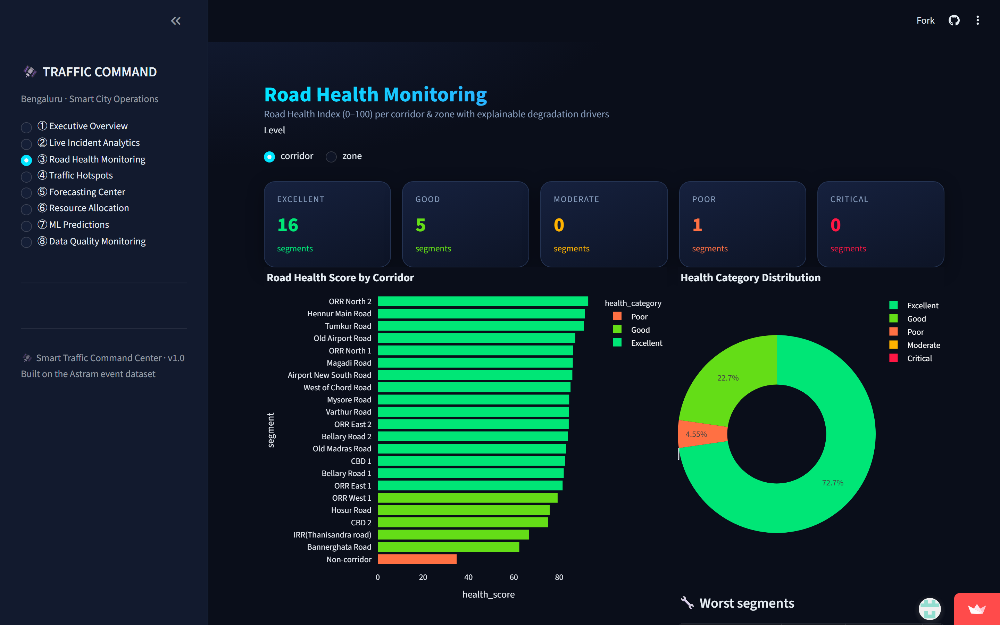
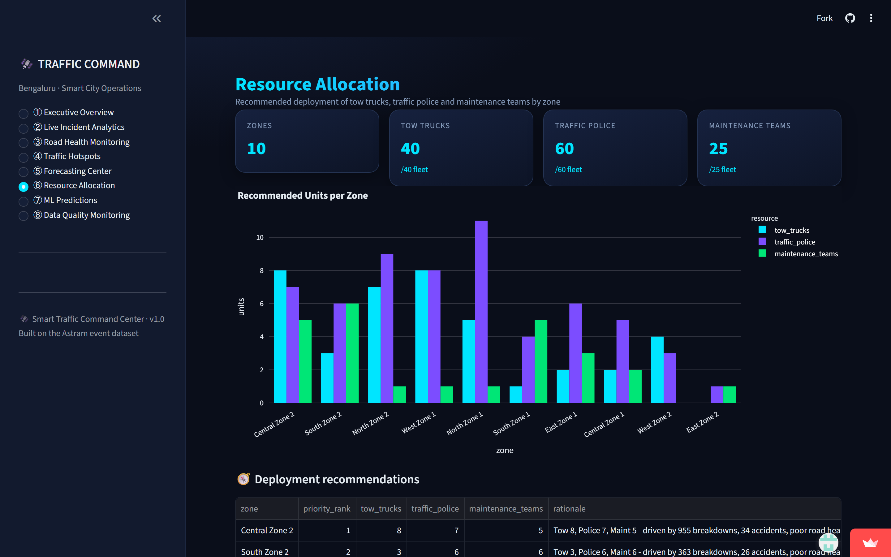
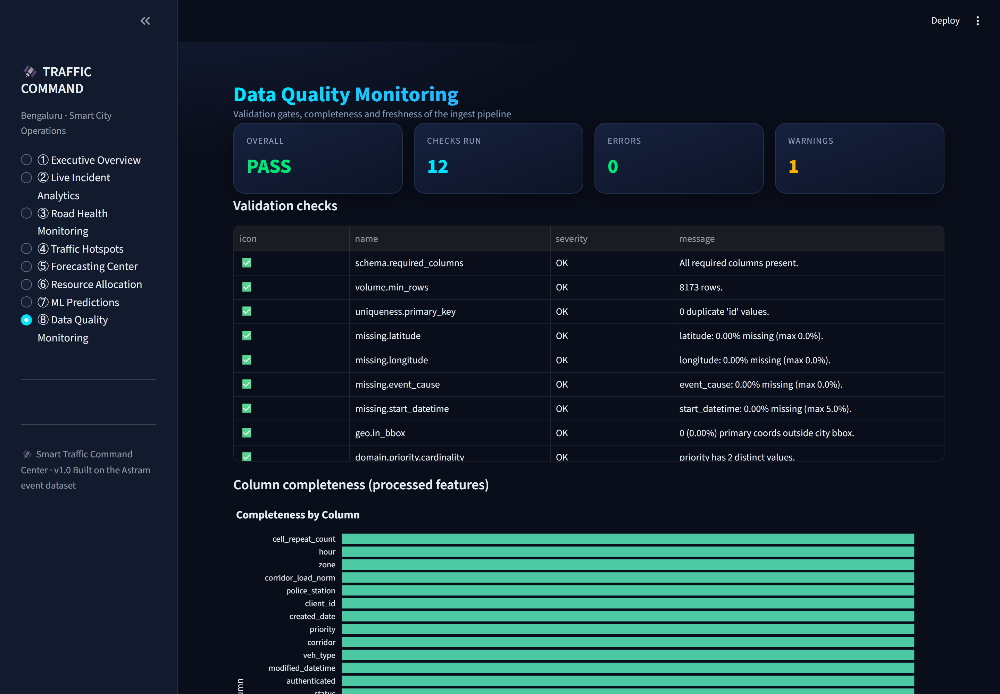

<div align="center">

# 🛰️ Smart Traffic Command Center
### + Smart Road Health Monitoring System

**An end-to-end data-science platform that turns raw traffic-incident logs into
real-time intelligence, road-health scores, geospatial hotspots, forecasts,
resource plans and ML predictions — served via a command-center dashboard *and*
a REST API.**

### 🔴 [**Launch the Live Demo →**](https://smart-traffic-command-center-5aa5hpssbwajldkgfmawc6.streamlit.app/)

[](https://smart-traffic-command-center-5aa5hpssbwajldkgfmawc6.streamlit.app/)


[](https://smart-traffic-command-center-5aa5hpssbwajldkgfmawc6.streamlit.app/)

</div>

---

## 🌟 Overview

Built on the **Astram** Bengaluru dataset (**8,173 incidents × 46 columns**, Nov 2023 – Apr 2024),
the platform ingests messy event logs and delivers six operational capabilities through a
modern **Smart City Command Center** UI and a documented API. Every component runs and has
been **verified end-to-end on the real data**.

> 🧭 New here? The **[Project Report & Technical Review](docs/PROJECT_REPORT.md)** has the full
> 7-dimension graded breakdown, including the validation behind the honest, leakage-free metrics.

---

## ✨ Capabilities

| | Capability | What it does |
|---|---|---|
| 🚦 | **Incident Intelligence** | Clean, enrich and explore 8k+ events: causes, vehicles, time-of-day heatmaps, maps. |
| 🛣️ | **Road Health Index (0–100)** | Explainable score per corridor & zone with per-cause "points lost" breakdown. |
| 📍 | **Hotspot Discovery** | DBSCAN density clusters + KMeans command zones per cause → **GeoJSON** export. |
| 📈 | **Forecasting** | Next day/week/month incident volume; auto-selects Prophet / XGBoost / LSTM / ETS. |
| 🚧 | **Resource Allocation** | Optimised tow-truck / police / maintenance deployment per zone (fleet-conserving). |
| 🤖 | **ML Predictions** | Priority, road-closure and resolution-time models (leakage-guarded) with CV, tuning, registry and live scoring. |

Plus **Data Quality Monitoring** (12 validation gates) and a **REST API** for integrations.

---

## 🏗️ Architecture



Full diagrams (C4 context, components, data flow, ML pipeline, deployment) →
**[docs/ARCHITECTURE.md](docs/ARCHITECTURE.md)**.

---

## 🚀 Quickstart

### Local
```bash
pip install -r requirements.txt
python -m src.run_pipeline          # build artifacts + train models (~3 min)
streamlit run dashboard/app.py      # 🖥️  http://localhost:8501
uvicorn src.api.main:app --port 8000 #🔌  http://localhost:8000/docs
```

### Docker (recommended for demos)
```bash
docker compose run --rm pipeline    # generate artifacts + models
docker compose up api dashboard     # serve both
```

### Make
```bash
make install && make pipeline && make dashboard   # or: make api / make test
```

### ☁️ Streamlit Community Cloud (zero-config)
Deploy with **main file `dashboard/app.py`** — no pre-build needed. The dashboard
**self-bootstraps**: on first load it builds the data, analytics, forecasts and
(compact) models from the committed raw CSV, then caches them. See
[deployment guide](docs/DEPLOYMENT.md#3a-streamlit-community-cloud-zero-config-demo).

---

## 🔌 REST API

Interactive Swagger UI at **`/docs`**. Highlights:

```bash
# Score an incident
curl -X POST http://localhost:8000/api/v1/predict -H "Content-Type: application/json" \
  -d '{"event_cause":"accident","corridor":"Hosur Road","veh_type":"heavy_vehicle","hour":18,
       "latitude":12.9081,"longitude":77.6476}'
# → {"priority":{"label":"High","probability":0.985},
#    "closure":{"label":"not_required","probability":0.055},
#    "resolution":{"value":0.9,"unit":"hours"}, ...}
```

9 endpoints: `health · stats · road-health · hotspots · hotspots/geojson · forecast ·
resources · quality · predict`. Full reference → **[docs/API.md](docs/API.md)**.

---

## 📊 Dashboard (8 pages)

`① Executive Overview · ② Live Incident Analytics · ③ Road Health Monitoring ·
④ Traffic Hotspots · ⑤ Forecasting Center · ⑥ Resource Allocation ·
⑦ ML Predictions · ⑧ Data Quality Monitoring`

Interactive filters · Plotly maps & charts · KPI cards · ROC/confusion diagnostics ·
CSV/GeoJSON downloads.



| ML Live Scoring — plain-English predictions | Model Performance — honest, leakage-guarded |
|:--:|:--:|
|  |  |
| **Traffic Hotspots** (DBSCAN + risk) | **Forecasting Center** |
|  |  |
| **Road Health Index** | **Resource Allocation** |
|  |  |



---

## 📁 Project structure

```
flipkart/
├── config/config.yaml              # single source of truth
├── data/  · models/ · outputs/     # tiered data + artifacts (generated)
├── src/
│   ├── utils/        logger.py, config.py
│   ├── data_pipeline/ ingest, validate, clean, feature_engineering
│   ├── engines/      road_health, hotspot, forecast, resource_allocator
│   ├── models/       train, predict, evaluate, registry
│   ├── api/          main.py, schemas.py        # FastAPI
│   └── run_pipeline.py                          # orchestrator
├── dashboard/        app.py, theme.py           # Streamlit
├── tests/            14 pytest tests
├── docs/             ARCHITECTURE · API · DEPLOYMENT · PROJECT_REPORT
├── Dockerfile · docker-compose.yml · Makefile · requirements.txt
```

---

## 🏁 Verified results

| Stage | Result |
|---|---|
| Cleaning | 8,173 → **7,971** rows · **4,668 zones** spatially imputed · 12/12 gates pass |
| Road Health | corridor mean **80.2** · zone mean **62.4** (worst: South Zone 2, 42.5) |
| Hotspots | **133** DBSCAN clusters · top pothole hotspot = 71 incidents |
| Forecast | city-wide **~84 incidents/day** (ETS auto-selected) |
| Models (leakage-guarded, threshold-tuned) | priority ROC-AUC **0.89** / PR-AUC 0.93 · closure ROC-AUC **0.76** / F1 0.38 · resolution-time R² **0.46** |
| Tests | **14 passed** in ~21 s |

> ✅ **Honest, leakage-guarded metrics.** Naïve models scored ~0.99 only because of **target
> leakage** — `corridor` is the priority *designation*, and `is_segment_event` (end-coordinates)
> is recorded with road closures. Those features are now **excluded per task**, so the scores above
> reflect genuine prediction. The third model targets the **real observed `resolution_hours`**
> (time-to-clear), not a synthetic score. Method in the
> [Project Report](docs/PROJECT_REPORT.md#4-ml-quality--80--10).

---

## 🧰 Tech stack

**Core:** Python · pandas · NumPy · scikit-learn · SciPy · statsmodels
**Serving:** FastAPI · Uvicorn · Streamlit · Plotly
**Optional (auto-detected):** XGBoost · LightGBM · Prophet · MLflow · SHAP · Folium · TensorFlow
**Ops:** Docker · Docker Compose · pytest · Make

---

## 📚 Documentation

| Doc | Contents |
|---|---|
| [Architecture](docs/ARCHITECTURE.md) | C4 diagrams, data flow, design decisions |
| [API](docs/API.md) | Endpoints, schemas, curl examples |
| [Deployment](docs/DEPLOYMENT.md) | Local · Docker · cloud · hardening checklist |
| [Project Report](docs/PROJECT_REPORT.md) | Full 7-dimension review, risks, roadmap |

---

## 🗺️ Roadmap

Live streaming ingestion · real severity labels · CI + drift monitoring ·
auth/TLS · object-storage + distributed compute · alerting & what-if simulation.

---

<div align="center">

Built on the anonymized **Astram** event dataset · CPU-only · runs on a laptop.

</div>
