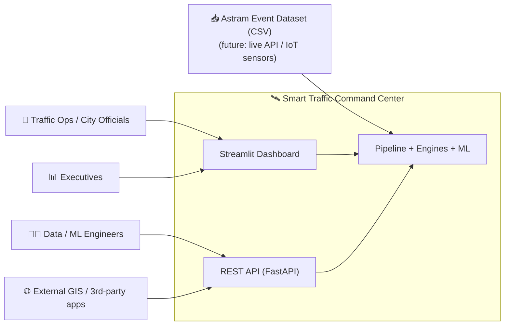
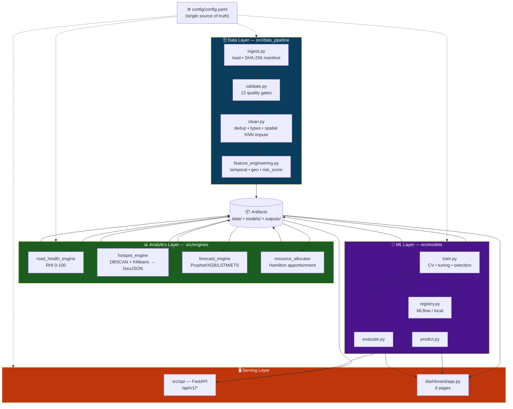
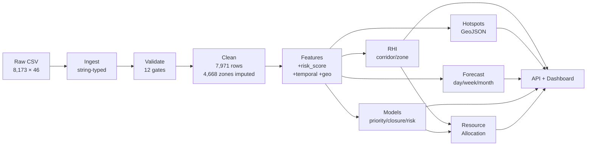
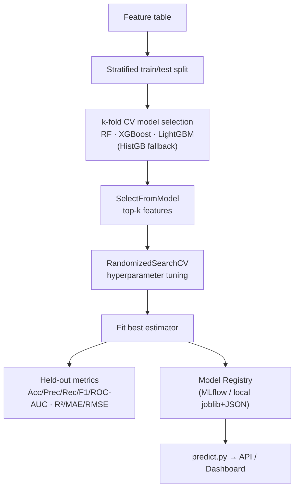
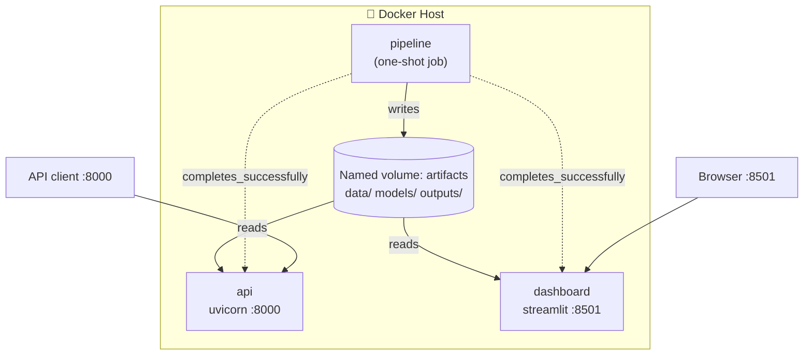

# System Architecture

Smart Traffic Command Center + Road Health Monitoring — technical architecture.

---

## 1. System Context (C4 Level 1)

---

## 2. Component Architecture (C4 Level 2)

---

## 3. Data Flow (end-to-end)

---

## 4. ML Training Pipeline

---

## 5. Deployment Topology (Docker Compose)

---

## 6. Key Design Decisions

| Decision | Rationale |
|---|---|
| **Config-driven** (`config.yaml`) | Tune weights, params, fleet sizes without touching code; reproducible. |
| **String-typed ingest** | No silent numeric coercion; cleaning owns all casting → auditable. |
| **Spatial KNN imputation** | Recovers 4,668 missing zones from geography instead of dropping rows. |
| **Engineered `risk_score`** | No ground-truth severity exists; transparent weighted proxy, leak-guarded in training. |
| **Optional-dependency fallbacks** | Runs fully on sklearn/statsmodels/plotly; XGBoost/LightGBM/Prophet/MLflow/Folium enhance when present. |
| **Shared preprocessor** | Same fitted `ColumnTransformer` at train & serve → no train/serve skew. |
| **One image, three roles** | pipeline/api/dashboard from a single Dockerfile via command override → smaller surface. |
| **Registry abstraction** | MLflow when available, local JSON+joblib otherwise → never blocks. |
